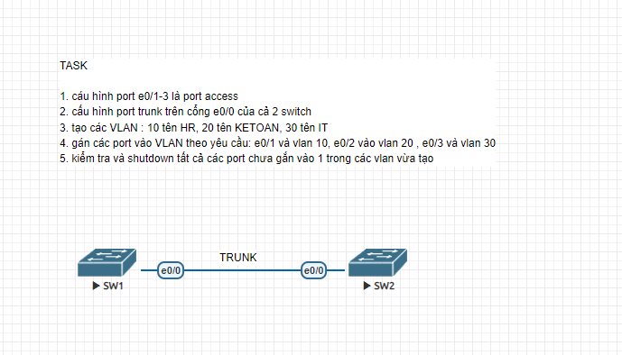

# HƯỚNG DẪN CẤU HÌNH BÀI LAB SWITCHING (VLAN, TRUNK, ACCESS)

Tài liệu này hướng dẫn chi tiết từng bước cấu hình thiết bị Switch Cisco theo các yêu cầu của bài lab bao gồm: cấu hình cổng Access, cấu hình cổng Trunk, khởi tạo VLAN, gán Port vào VLAN và bảo mật các cổng không sử dụng..

## Sơ đồ mạng (Topology)

## Các file cấu hình thiết bị
* [Cấu hình chi tiết SW 1](SW1.txt)
* [Cấu hình chi tiết SW 2](SW2.txt)
