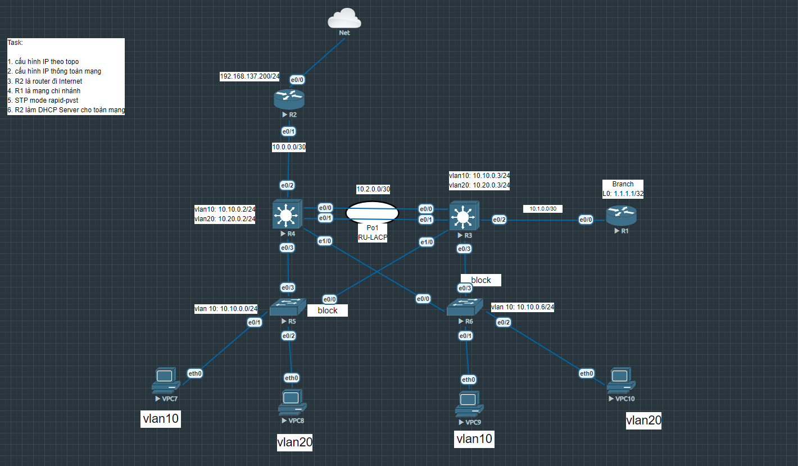

# VLANs, Inter-VLAN Routing, LACP, Spanning-Tree, DHCP Server

Bài lab mô phỏng một kiến trúc mạng doanh nghiệp thực tế bao gồm vùng Trụ sở chính (Headquarter), một Chi nhánh (Branch Office) và kết nối đi Internet thông qua thiết bị Gateway biên.

## Sơ đồ mạng (Topology)

