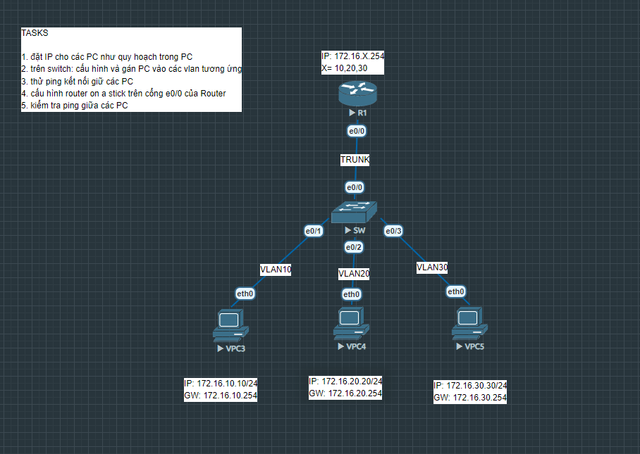

# ROUTER ON A STICK

Bài lab này giúp mô phỏng và cấu hình kỹ thuật Router-on-a-Stick để định tuyến (routing) các gói tin giữa các VLAN khác nhau thông qua một cổng vật lý duy nhất trên Router.

## Sơ đồ mạng (Topology)

## Các file cấu hình thiết bị
* [Cấu hình chi tiết R1  ](SR1.txt)
* [Cấu hình chi tiết SW1 ](SW.txt)
* [Cấu hình chi tiết VPC3](VPC3.txt)
* [Cấu hình chi tiết VPC4](VPC4.txt)
* [Cấu hình chi tiết VPC5](VPC5.txt)