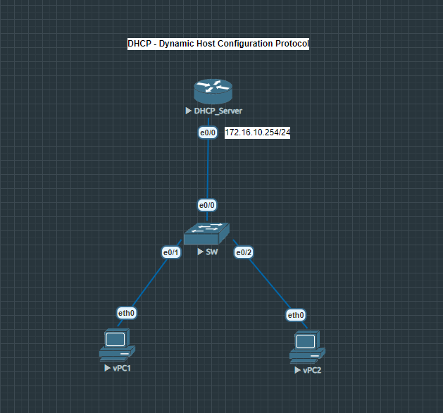

# DHCP Server Configuration Protocol

Bài lab này giải quyết bài toán: Cấu hình Cisco Router làm DHCP Server để cấp phát cấu hình mạng tự động cho các thiết bị đầu cuối (vPC1 và vPC2).

Thay vì bạn phải đến từng máy tính cài đặt IP tĩnh một cách thủ công (dễ sai sót, tốn thời gian), Router sẽ tự động làm việc này.

## Sơ đồ mạng (Topology)

## Các file cấu hình thiết bị
* [Cấu hình chi tiết DHCP_Server      ](DHCP_Server.txt)
