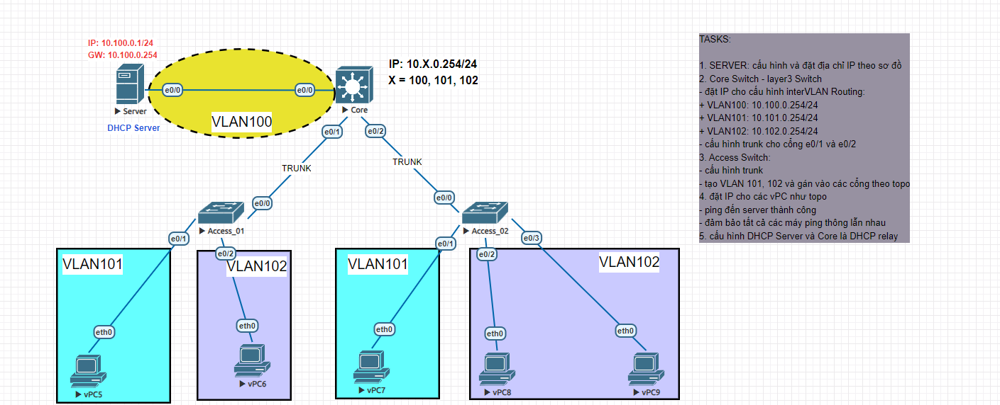

# DHCP RELAY AGENT & INTER-VLAN ROUTING

triển khai mô hình định tuyến giữa các VLAN (Inter-VLAN Routing) sử dụng Core Switch Layer 3 làm thiết bị định tuyến trung tâm. Hệ thống tích hợp tính năng DHCP Relay Agent (ip helper-address) trên Core Switch để chuyển tiếp các yêu cầu xin cấp phát IP động từ các máy trạm (vPC) thuộc VLAN 101 và 102 về máy chủ DHCP Server tập trung nằm ở vùng mạng VLAN 100. Mục tiêu của bài lab là cấu hình đồng bộ các đường trung kế (Trunking), chia cổng Access chuẩn xác để đảm bảo toàn bộ các máy trạm nhận được IP tự động và có thể ping thông suốt toàn mạng.

## Sơ đồ mạng (Topology)

## Các file cấu hình thiết bị
* [Cấu hình chi tiết DHCP_Server      ](DHCP_Server.txt)
* [Cấu hình chi tiết Core             ](Core.txt)
* [Cấu hình chi tiết Access_01        ](Access_01.txt)
* [Cấu hình chi tiết Access_02        ](Access_02.txt)
