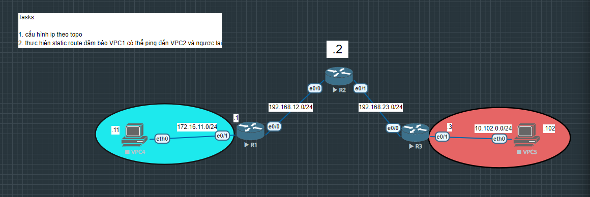

# Static Routing 

Mục tiêu của bài lab là thiết lập kết nối giữa hai mạng LAN khác nhau thông qua nhiều router bằng cách sử dụng static route.

## Sơ đồ mạng (Topology)

## Các file cấu hình thiết bị
* [Cấu hình chi tiết Router 1      ](R1.txt)
* [Cấu hình chi tiết Router 2      ](R2.txt)
* [Cấu hình chi tiết Router 3      ](R3.txt)
