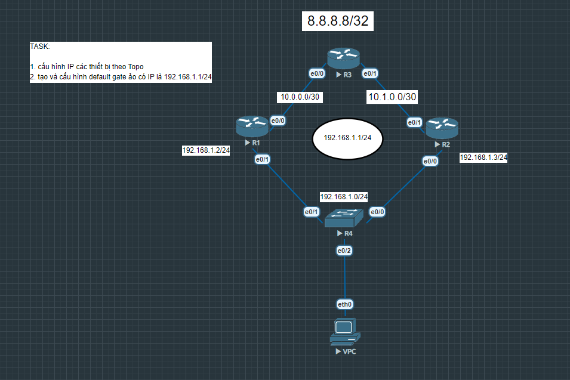

# FHRP Concepts

Bài lab này mô phỏng mô hình dự phòng Default Gateway bằng giao thức FHRP (HSRP) trên Cisco IOS.

Mục tiêu chính:

Cấu hình IP theo topology
Tạo Virtual Gateway 192.168.1.1/24
Cho phép PC luôn có gateway hoạt động ngay cả khi một router bị lỗi
Kiểm tra failover giữa các router

## Sơ đồ mạng (Topology)

## Các file cấu hình thiết bị
* [Cấu hình chi tiết Router 1      ](R1.txt)
* [Cấu hình chi tiết Router 2      ](R2.txt)
* [Cấu hình chi tiết Router 3      ](R3.txt)