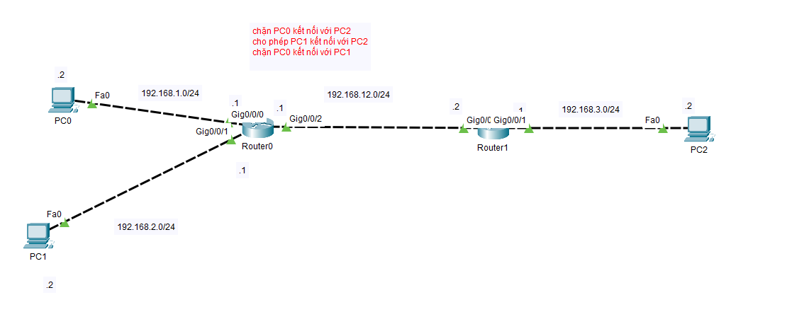

# Network Access Control List (ACL) Simulation Lab

Một bài lab mô phỏng cấu hình mạng và thiết lập các quy tắc kiểm soát truy cập (ACL) trên Cisco Packet Tracer nhằm quản lý lưu thông dòng dữ liệu giữa các mạng con.

## 📋 Tổng quan sơ đồ mạng (Topology)

Hệ thống mạng được chia làm 4 lớp mạng chính kết nối qua 2 Router:
* **Mạng PC0:** `192.168.1.0/24` (IP PC0: `192.168.1.2`, Gateway: `192.168.1.1` trên cổng Gig0/0/0 của Router0)
* **Mạng PC1:** `192.168.2.0/24` (IP PC1: `192.168.2.2`, Gateway: `192.168.2.1` trên cổng Gig0/0/1 của Router0)
* **Mạng Liên kết (Router0 - Router1):** `192.168.12.0/24` (Router0: `192.168.12.1` trên Gig0/0/2, Router1: `192.168.12.2` trên Gig0/0)
* **Mạng PC2:** `192.168.3.0/24` (IP PC2: `192.168.3.2`, Gateway: `192.168.3.1` trên cổng Gig0/0/1 của Router1)

---

## 🎯 Yêu cầu cấu hình kỹ thuật (Lab Objectives)

Mục tiêu chính của bài lab là cấu hình thành công các quy tắc **Access Control List (ACL)** trên Router để thực thi chính sách bảo mật sau:

1.  ❌ **Chặn PC0 kết nối với PC2** (`192.168.1.2` không thể ping/kết nối đến `192.168.3.2`).
2.  ✅ **Cho phép PC1 kết nối với PC2** (`192.168.2.2` truyền thông bình thường với `192.168.3.2`).
3.  ❌ **Chặn PC0 kết nối với PC1** (Cách ly hoàn toàn lưu thông giữa hai mạng nội bộ `192.168.1.0/24` và `192.168.2.0/24`).