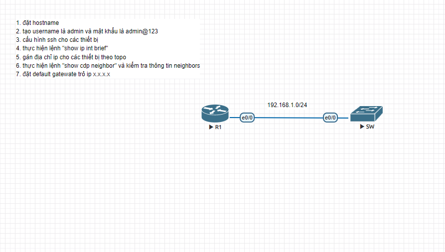

# Cisco Basic Router Configuration Lab

Bài lab này mô phỏng một mô hình mạng cơ bản kết nối trực tiếp (Point-to-Point) giữa hai thiết bị Cisco: một **Router (Layer 3)** đóng vai trò định tuyến luồng dữ liệu trung tâm và một **Switch (Layer 2)** đóng vai trò chuyển mạch nội bộ. 

Mục đích cốt lõi của bài lab là thiết lập cấu hình nền tảng cấu thành nên một hệ thống mạng doanh nghiệp an toàn, bao gồm việc định danh thiết bị, phân quyền quản trị, kích hoạt giao thức bảo mật đường truyền từ xa và kiểm tra tính toàn vẹn của kết nối vật lý.

---

## Sơ đồ mạng (Topology)

## Các file cấu hình thiết bị
* [Cấu hình chi tiết Router 1](Cấu%20hình%20R1.txt)
* [Cấu hình chi tiết Switch  ](cấu%20hình%20SW.txt)

