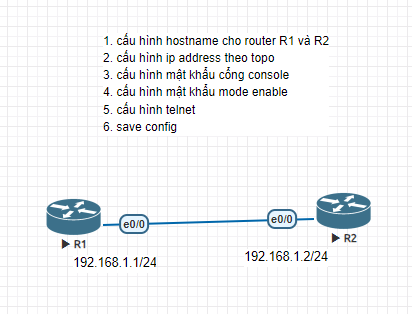

# Cisco Basic Router Configuration Lab

Bài lab thực hành cấu hình cơ bản cho Router Cisco: Đặt IP, cấu hình Password, mã hóa mật khẩu, Telnet và Console.

## Sơ đồ mạng (Topology)

## Các file cấu hình thiết bị
* [Cấu hình chi tiết Router 1](Cấu%20hình%20R1.txt)
* [Cấu hình chi tiết Router 2](cấu%20hình%20R2.txt)

## Các yêu cầu đã hoàn thành
0. Cấu hình router hostname (`R1`, `R2`)
1. Cấu hình IP Address theo sơ đồ
2. Kiểm tra Ping thông suốt giữa 2 router
3. Cấu hình enable password "khanhvc"
4. Mã hóa mật khẩu plain-text (`service password-encryption`)
5. Cấu hình enable secret "enable"
6. Cấu hình 5 lines VTY Telnet với password "khanhvctelnet"
7. Kiểm tra kết nối từ xa qua Telnet thành công
8. Cấu hình console password "console"
9. Lưu cấu hình vào NVRAM (`write`)